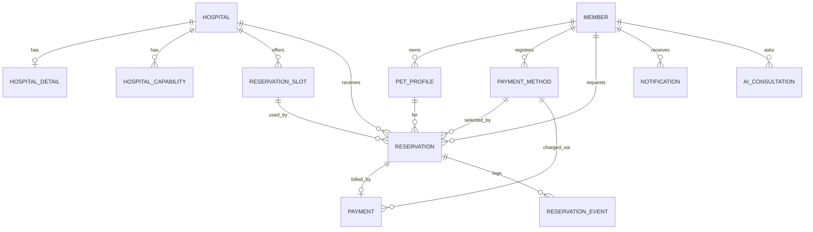
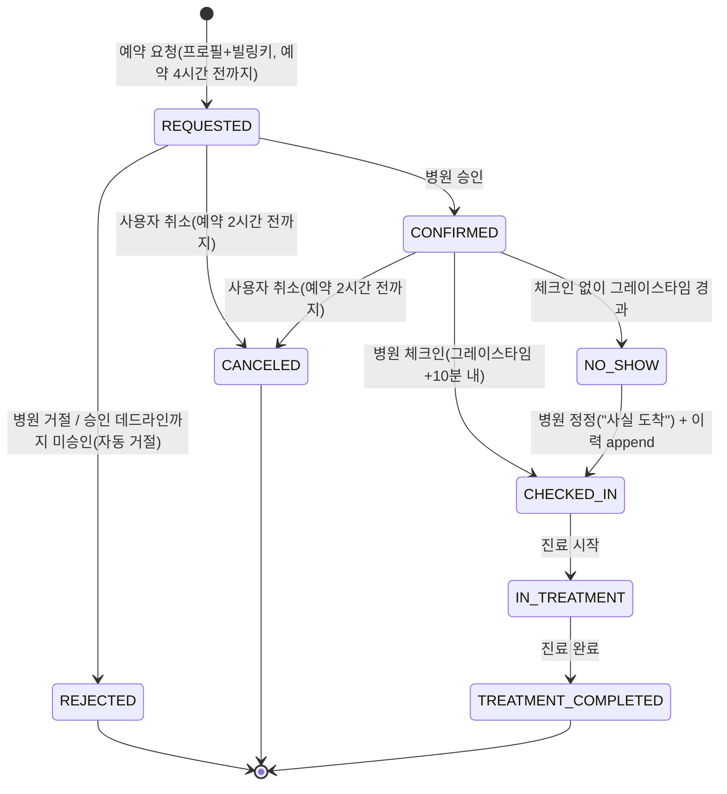
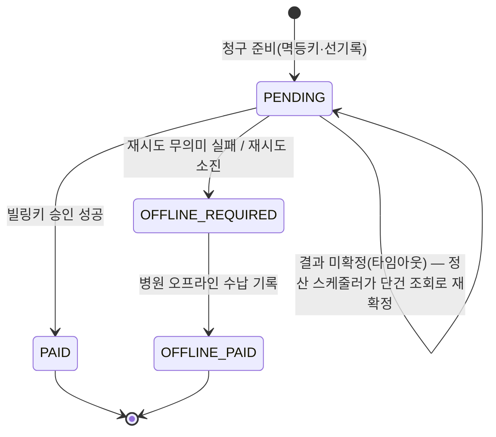
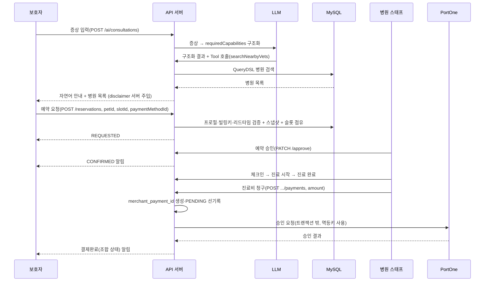
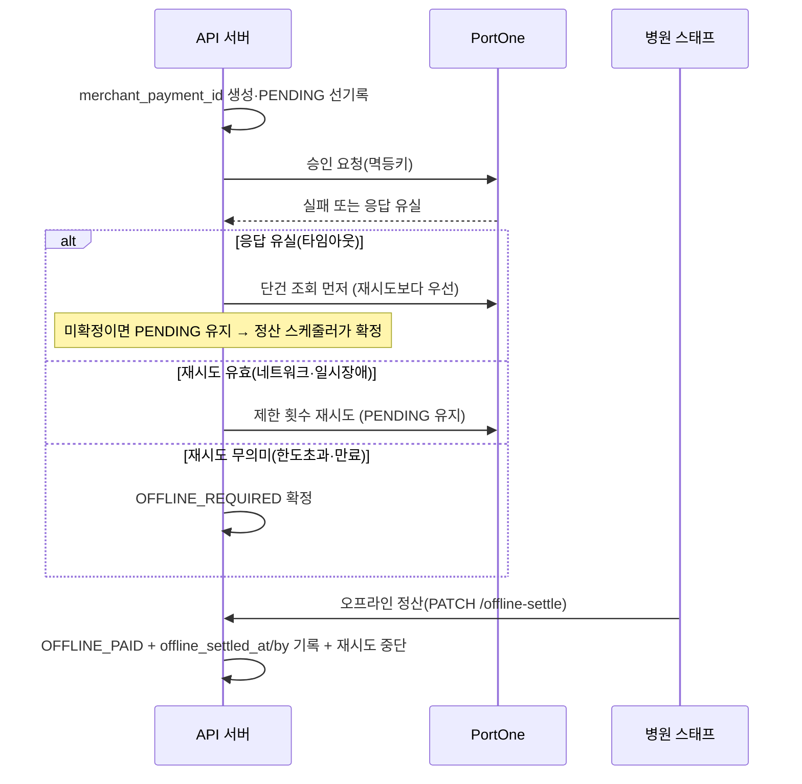
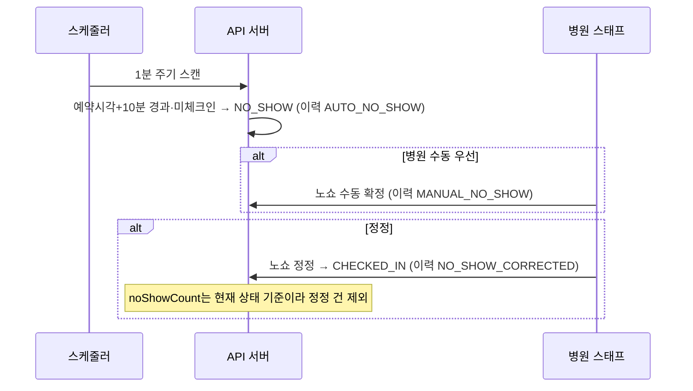

# DoctorPet 시스템 아키텍처 문서 (SA)

| 항목 | 내용 |
| --- | --- |
| 제품명 | DoctorPet |
| 문서 버전 | v1.8 |
| 작성 기준일 | 2026-07-24 |
| 상위 근거 | PRD, 정책 정리본, 코드 컨벤션 (버전은 각 문서 헤더 참조) |

PRD가 정의한 요구사항을 구현 가능한 설계로 확정한다(ERD·API·상태 머신·핵심 기능·인프라). PRD와 충돌하면 PRD를 따른다. 코드 스타일·클래스 규약은 코드 컨벤션 문서를 따른다. 아직 안 정한 선택지는 본문에 `[결정 필요]`로 표기하고 부록 A에 모은다.

> 변경 이력 — v1.4: 환불 MVP 제외, 결제 멱등키(`merchant_payment_id`), `PAYMENT_COMPLETED` 제거(조합 표시), 이력 방식 B 등 리뷰 반영. v1.5~v1.6: 미확정 13건 확정(낙관적 락 실채택, Redis 캐시, 재시도 3회, 상한 300만원, 이메일 익명화, 슬롯 14일치 등 — 부록 A 참조) + 표현 경량화(사실관계 변경 없음). v1.7: 예약 상태 전이 조건부 UPDATE 보호 규칙 추가(§5), 부록 A에 탈퇴 시 활성 예약·미수금 처리 미확정 등재(하네스 2차 감사 반영). v1.8: 병원 매핑 복합 키, 슬롯-예약 1:N, AI 구조화 출력 5필드 저장을 확정하고 검색 Tool 실패 응답 주체의 문서 충돌을 미확정으로 등재.

---

# 1. 아키텍처 개요

구성 요소는 다섯이다.

- **API 서버** — Spring Boot. 도메인 로직·API 제공.
- **MySQL** — 회원·병원·예약·결제 트랜잭션 데이터.
- **Redis** — Refresh Token 저장, 검색 원격 캐시(§9-2). 동시성은 낙관적 락이라 Redis 분산 락은 안 쓴다.
- **LLM** — 증상 → 진료역량 구조화, 검색 Tool 호출. 외부 서비스.
- **PortOne V2** — 빌링키 발급·후불 결제 승인·단건 조회.

병원 공공데이터 API는 배치 수집원으로만 쓰고 런타임 검색 경로에는 개입하지 않는다. 검색은 항상 자체 DB를 대상으로 한다.

```
[클라이언트]
     │  HTTPS
     ▼
[DoctorPet API 서버] ──▶ [MySQL]
     │   │   │
     │   │   └────────▶ [Redis]  (RefreshToken / 검색 캐시)
     │   └────────────▶ [LLM]    (증상→역량, Tool Calling)
     └────────────────▶ [PortOne](빌링키·결제·단건조회)

[스케줄러] ──▶ [공공데이터 API] ──▶ [MySQL]   (배치 적재, 런타임과 분리)
```

---

# 2. 기술 스택

- Java 17, Spring Boot, Spring Data JPA, Spring Security
- QueryDSL(동적 쿼리), MySQL 8.x, Redis(Lettuce)
- JWT(Access/Refresh), PortOne V2(빌링키), Spring Scheduler
- Gradle, JUnit5, Mockito, @SpringBootTest
- 인프라(도전): Docker, AWS(EC2·RDS·ElastiCache), GitHub Actions, k6

확정 사항: 검색 캐시는 Redis 원격 캐시(TTL·키 prefix는 구현 시 조정). AI는 LLM 연동(구조화 출력 + Tool Calling)이되 `AiGateway` 인터페이스만 먼저 확정하고 모델/제공자 구현체는 착수 시 정한다. 실시간 알림은 MVP는 폴링이고 SSE/WebSocket push는 채팅 도입 여부에 따라 추후 재논의한다(§9-8).

---

# 3. 패키지 구조

```
com.doctorpet
├── global
│   ├── config          보안·JPA·스케줄러·캐시·QueryDSL 설정
│   ├── security        JWT 필터, 인증 주체(Principal) 해석
│   ├── exception       ErrorCode, CommonErrorCode, ServiceException, GlobalExceptionHandler
│   ├── response        ApiResponse
│   └── gateway         외부 연동 추상화 (PaymentGateway, AiGateway, PublicDataGateway)
│
└── domain
    ├── member          회원·인증·역할(보호자/병원 스태프)
    ├── pet             반려동물 프로필(PetProfile)
    ├── hospital        병원 마스터·진료역량·예약 슬롯
    ├── search          병원 검색(QueryDSL)
    ├── reservation     예약 요청·승인/거절·상태 전이·노쇼·이력
    ├── payment         결제수단(빌링키)·후불 결제·오프라인 정산
    ├── ai              증상 → 진료역량 추천·Tool Calling
    ├── notification    알림
    └── publicdata      공공데이터 배치 적재
```

다른 도메인의 Repository를 직접 호출하지 않고 Service를 경유한다. 여러 도메인 흐름은 `XxxApplicationService`로 분리한다. `global.gateway`는 모든 도메인이 참조 가능하나 역은 안 된다.

---

# 4. 도메인 모델 (ERD)



모듈 경계를 넘는 `@ManyToOne`은 두지 않고 FK 값(Long)으로 참조한다. `deleted_at`을 가진 테이블(`members`, `pet_profiles`)은 조회 시 기본적으로 `deleted_at IS NULL` 행만 노출한다(`@SQLRestriction` 등). 삭제된 행은 이력 참조용으로만 남긴다.

### members

| 컬럼 | 타입 | 설명 |
| --- | --- | --- |
| id | BIGINT PK | |
| email | VARCHAR | 로그인 식별자. 활성 회원 기준 중복 검사(§6-3) |
| password | VARCHAR | 해시 |
| nickname | VARCHAR | |
| role | VARCHAR | GUARDIAN / HOSPITAL_STAFF |
| hospital_id | BIGINT NULL | 스태프 소속 병원(보호자는 NULL) |
| created_at | DATETIME | |
| deleted_at | DATETIME NULL | Soft Delete |

탈퇴 시 이메일을 익명화한다(예: `withdrawn_{memberId}@deleted.doctorpet`). `email UNIQUE`를 그대로 유지하면서 원 이메일의 재가입을 허용하기 위함이다. 로그인·중복검사는 `deleted_at IS NULL`만 대상으로 한다.

### pet_profiles

| 컬럼 | 타입 | 설명 |
| --- | --- | --- |
| id | BIGINT PK | |
| member_id | BIGINT FK | 소유 보호자 |
| name | VARCHAR | |
| species | VARCHAR | DOG / CAT |
| age | INT | |
| weight | DECIMAL | |
| neutered | BOOLEAN | |
| created_at | DATETIME | |
| deleted_at | DATETIME NULL | Soft Delete(예약이 pet_id 참조) |

프로필을 Soft Delete하면 기본 조회에서 빠진다. 과거 예약 상세가 깨지지 않도록 예약 생성 시 반려동물 이름·종을 `reservations`에 스냅샷으로 보존하고, 예약 상세는 스냅샷을 우선 쓴다.

### hospitals (공공데이터 기반)

| 컬럼 | 타입 | 설명 |
| --- | --- | --- |
| id | BIGINT PK | |
| mgmt_no | VARCHAR | 관리번호(공공데이터 조인 키) |
| local_gov_code | VARCHAR | 지자체 코드 |
| name | VARCHAR | 병원명 |
| phone | VARCHAR | 전화번호 |
| address_jibun | VARCHAR | 지번주소 |
| address_road | VARCHAR | 도로명주소 |
| zipcode | VARCHAR | 우편번호 |
| coord_x | DECIMAL | 좌표 X |
| coord_y | DECIMAL | 좌표 Y |
| license_date | DATE | 인허가일자 |
| business_status | VARCHAR | OPEN / CLOSED_TEMP / CLOSED |
| close_date | DATE NULL | 휴·폐업일 |
| area | DECIMAL NULL | 사업장 면적 |
| source_modified_at | DATETIME | 공공데이터 최종 수정일 |
| partnership_status | VARCHAR | PARTNER / NON_PARTNER |

인덱스: `(business_status)`, `(coord_x, coord_y)` — 영업상태 필터·거리 계산용.
제약: `UNIQUE(local_gov_code, mgmt_no)` — 지자체 범위의 관리번호를 공공데이터·제휴 데이터 복합 매핑 키로 사용한다.

### hospital_details (제휴 병원만, 자체 보강)

| 컬럼 | 타입 | 설명 |
| --- | --- | --- |
| id | BIGINT PK | |
| hospital_id | BIGINT FK UNIQUE | |
| open_hours | VARCHAR/JSON | 요일별 영업시간 |
| surgery_available | BOOLEAN | 수술 가능 |
| hospitalization_available | BOOLEAN | 입원 가능 |
| night_care | BOOLEAN | 야간 진료 |
| emergency | BOOLEAN | 응급 진료 |

### hospital_capabilities (제휴 병원 진료역량, 1:N)

| 컬럼 | 타입 | 설명 |
| --- | --- | --- |
| id | BIGINT PK | |
| hospital_id | BIGINT FK | |
| capability_type | VARCHAR | SPECIES / EXAM / TREATMENT / EQUIPMENT |
| capability_value | VARCHAR | 예: 엑스레이, 정형외과 진료, 초음파 |

인덱스: `(capability_type, capability_value, hospital_id)` — 역량 AND 매칭 조인용. `requiredCapabilities`·`species` 검색이 이 테이블을 대상으로 매칭한다. 화이트리스트는 소수 고정 카테고리로 확정(엑스레이·초음파·정형외과·내과·외과·피부과·치과·안과·야간응급 등 10~15개)하되, 구체 목록은 병원 시드 데이터 작성 시 함께 정한다. AI 프롬프트와 검색 조건이 같은 목록을 공유한다.

### reservation_slots (제휴 병원, 사전 생성)

| 컬럼 | 타입 | 설명 |
| --- | --- | --- |
| id | BIGINT PK | |
| hospital_id | BIGINT FK | |
| start_at | DATETIME | 예약 시각 |
| end_at | DATETIME | |
| status | VARCHAR | OPEN / RESERVED |
| version | BIGINT | 낙관적 락 버전 컬럼(§9-3). `@Version`으로 동시 점유 충돌 감지 |

제약: `UNIQUE(hospital_id, start_at)` — 중복 슬롯 방지, 배치 재실행 시 멱등(§9-9). 인덱스: `(hospital_id, status, start_at)`.

### reservations

| 컬럼 | 타입 | 설명 |
| --- | --- | --- |
| id | BIGINT PK | |
| member_id | BIGINT FK | 요청 보호자 |
| pet_id | BIGINT FK | 대상 반려동물 |
| pet_name_snapshot | VARCHAR | 예약 시점 이름(프로필 삭제 대비) |
| pet_species_snapshot | VARCHAR | 예약 시점 종 |
| hospital_id | BIGINT FK | |
| slot_id | BIGINT FK | 점유 슬롯 |
| payment_method_id | BIGINT FK | 예약 요청 시 확정한 결제수단 |
| status | VARCHAR | ReservationStatus(§5-1). `PAYMENT_COMPLETED` 없음 — `TREATMENT_COMPLETED`가 종착 |
| reject_reason | VARCHAR NULL | 거절 사유 |
| requested_at | DATETIME | |
| confirmed_at | DATETIME NULL | |
| canceled_at | DATETIME NULL | |
| no_show_at | DATETIME NULL | |

인덱스: `(slot_id)`, `(member_id, status)`, `(hospital_id, status)`.

하나의 슬롯은 거절·취소·승인 타임아웃으로 반환된 뒤 다시 예약될 수 있으므로 예약 이력과는 1:N 관계다. 단, 같은 시점에 활성 예약은 1건만 허용한다. 예약 요청 트랜잭션에서 `reservation_slots.version` 낙관적 락으로 `OPEN → RESERVED` 점유를 원자적으로 처리하며, 충돌한 요청은 실패시킨다(§9-3).

### reservation_events (append-only, 방식 B)

| 컬럼 | 타입 | 설명 |
| --- | --- | --- |
| id | BIGINT PK | |
| reservation_id | BIGINT FK | |
| event_type | VARCHAR | AUTO_NO_SHOW / MANUAL_NO_SHOW / NO_SHOW_CORRECTED / TIMEOUT_REJECTED |
| memo | VARCHAR NULL | |
| occurred_at | DATETIME | |

예약 도메인의 예외·비가역 사건만 기록한다(방식 B). 정상 전이(요청·승인·체크인·진료·완료·취소)는 `reservations`의 상태·시각 컬럼으로 표현하고 이 테이블에 남기지 않는다. 노쇼 자동/수동 판정, 노쇼 정정, 승인 타임아웃 자동거절처럼 상태만으로는 흔적이 사라지는 사건만 추가한다. 결제 사건(오프라인 정산 등)은 여기가 아니라 `payments` 쪽에 기록한다. 추가만 하고 수정·삭제하지 않는다.

### payment_methods (빌링키)

| 컬럼 | 타입 | 설명 |
| --- | --- | --- |
| id | BIGINT PK | |
| member_id | BIGINT FK | |
| billing_key_enc | VARBINARY/VARCHAR | 암호화 저장 |
| card_brand | VARCHAR NULL | 표시용 |
| card_last4 | VARCHAR NULL | 표시용 뒷 4자리 |
| status | VARCHAR | ACTIVE / EXPIRED / DELETED |
| created_at | DATETIME | |

카드번호·유효기간·CVC 원본은 저장하지 않는다. 결제수단이 삭제·만료돼도 예약/결제는 청구 시점 스냅샷(`payments.card_*_snapshot`)으로 이력을 유지한다.

진행 중 예약이 참조하는 결제수단이라도 삭제는 제한 없이 허용한다(카드 관리·보안 사유로 언제든 지울 수 있어야 한다). 대신 청구 시점에 `status == ACTIVE`인지 재확인하고, 삭제·만료됐으면 자동 청구를 시도하지 않고 곧바로 `OFFLINE_REQUIRED`로 확정한다(§9-4의 "재시도 무의미" 분기와 같은 경로). 청구는 대부분 병원 스태프가 진료 완료 직후 현장에서 트리거하므로, 실패해도 그 자리에서 다른 결제수단으로 대체 수납하면 된다.

### payments

| 컬럼 | 타입 | 설명 |
| --- | --- | --- |
| id | BIGINT PK | |
| reservation_id | BIGINT FK UNIQUE | 예약당 결제 1건(이중 청구 방지) |
| merchant_payment_id | VARCHAR UNIQUE | 외부 요청 전 서버가 생성하는 멱등키. PortOne 요청·조회·재시도에 동일 사용(§9-4) |
| payment_method_id | BIGINT FK | 청구에 쓴 결제수단 |
| card_brand_snapshot | VARCHAR NULL | 청구 시점 카드 브랜드 |
| card_last4_snapshot | VARCHAR NULL | 청구 시점 카드 뒷자리 |
| amount | INT | 최종 진료비. 0 초과 & 절대 상한(300만원) 이하만 허용 |
| status | VARCHAR | PENDING / PAID / OFFLINE_REQUIRED / OFFLINE_PAID |
| payment_channel | VARCHAR | BILLING_KEY / OFFLINE |
| retry_count | INT | 재시도 횟수 |
| failure_reason | VARCHAR NULL | 실패 사유 |
| pg_payment_id | VARCHAR NULL | PortOne 결제 식별자(단건조회용) |
| offline_settled_at | DATETIME NULL | 오프라인 수납 시각(감사) |
| offline_settled_by | BIGINT NULL | 오프라인 수납 스태프 member_id(감사) |
| created_at | DATETIME | |
| paid_at | DATETIME NULL | |

환불(REFUNDED)은 MVP 제외(부분 환불은 확장). 결제가 단선 흐름(`PENDING→PAID` 또는 `PENDING→OFFLINE_REQUIRED→OFFLINE_PAID`)이라 행이 덮어써지지 않아 단일 행으로 이력이 보존된다. 환불·재청구를 확장으로 도입할 때 결제 이력 테이블(또는 Payment 1:N)을 추가한다.

### ai_consultations (상담 로그 + 운영·비용 측정)

| 컬럼 | 타입 | 설명 |
| --- | --- | --- |
| id | BIGINT PK | |
| member_id | BIGINT FK NULL | 비로그인 임시 상담 시 NULL |
| symptom_text | TEXT | 입력 증상. 보존 30일 + 패턴 마스킹(전화·이메일·주민번호 등 정규식 마스킹). 30일 경과 건 배치 삭제 |
| structured_result | JSON | AI 구조화 출력 5필드(`possibleFocusAreas`, `requiredCapabilities`, `urgencyLevel`, `preVisitCheckpoints`, `recommendVetVisit`) 전체 |
| required_capabilities | JSON | AI 도출 역량. 검색·조회 편의를 위해 `structured_result`와 중복 저장 |
| urgency_level | VARCHAR | LOW / MODERATE / HIGH. 조회·집계 편의를 위해 `structured_result`와 중복 저장 |
| model | VARCHAR | 사용 모델 |
| prompt_version | VARCHAR | 프롬프트 버전 |
| prompt_tokens | INT | 입력 토큰 |
| completion_tokens | INT | 출력 토큰 |
| latency_ms | INT | 응답 지연 |
| status | VARCHAR | SUCCESS / FAILED |
| error_type | VARCHAR NULL | TIMEOUT / RATE_LIMIT / SERVER_ERROR |
| fallback_used | BOOLEAN | 규칙기반 대체 여부 |
| tool_call_status | VARCHAR | 검색 Tool 호출 성공/실패 |
| schema_parse_success | BOOLEAN | 구조화 출력 파싱 성공 |
| created_at | DATETIME | |

`structured_result`에는 AI 구조화 출력 5필드 원본을 그대로 저장한다. `required_capabilities`와 `urgency_level`은 검색·조회·집계 편의를 위한 중복 저장 컬럼이며 같은 트랜잭션에서 일관되게 기록한다. 이 필드들로 AI 필수 요건(구조화 출력·Tool Calling·장애 격리)과 비용·품질을 수치로 검증한다. 원문(`symptom_text`)만 30일 후 삭제하고, 나머지 구조화 지표 필드는 개인정보가 아니므로 더 길게(프로젝트 기간 내) 보관해 분석에 쓴다. 입력 길이 제한·Rate Limit 수치는 `[결정 필요]`.

### notifications

| 컬럼 | 타입 | 설명 |
| --- | --- | --- |
| id | BIGINT PK | |
| member_id | BIGINT FK | |
| type | VARCHAR | RESERVATION_CONFIRMED / REJECTED / PAYMENT_RESULT / NO_SHOW 등 |
| content | VARCHAR | |
| is_read | BOOLEAN | |
| created_at | DATETIME | |

### payment_webhooks (확장)

| 컬럼 | 타입 | 설명 |
| --- | --- | --- |
| id | BIGINT PK | |
| payment_id | BIGINT FK | |
| event_type | VARCHAR | |
| received_at | DATETIME | |

제약: `UNIQUE(payment_id, event_type)` — 중복 수신 1회만 반영.

---

# 5. 상태 머신

예약과 결제 상태는 분리해서 관리한다. 어느 한쪽에 다른 쪽 상태를 넣지 않는다(동기화 부담·불일치 방지). 전체 진행 상태는 §5-4처럼 두 상태를 조합해 계산한다.

**상태 전이의 동시성 보호**: 예약 상태 전이는 조건부 UPDATE(`WHERE status = 기대 상태`)로 보호한다. 갱신 행 수가 0이면 다른 전이가 먼저 일어난 것이므로 덮어쓰지 않는다. 특히 스케줄러의 자동 전이(노쇼 판정·승인 타임아웃)는 0행이면 조용히 건너뛴다 — 이것이 "수동 판정 우선"의 구현 방식이다. 슬롯 점유 동시성(§9-3 낙관적 락)과는 별개의 보호 장치다.

## 5-1. 예약 상태 (ReservationStatus, 병원 승인형)



전이 규칙:

- REQUESTED 진입 전제: 프로필 + 빌링키 등록, 예약시각 4시간 전까지.
- REJECTED: 병원 거절, 또는 승인 데드라인 경과 시 스케줄러 자동 거절(이력 `TIMEOUT_REJECTED`). 슬롯 반환, 후불이라 환불 불필요. 데드라인 = `min(요청시각+1시간, 예약시각−2시간)`.
- CANCELED: 사용자 취소. REQUESTED·CONFIRMED 두 상태 모두 예약시각 2시간 전까지. 슬롯 반환.
- NO_SHOW: 예약시각 +10분 경과 시 스케줄러 자동, 또는 병원 수동(자동보다 우선). 정정 시 CHECKED_IN 재전이.
- `PAYMENT_COMPLETED`는 예약 상태에 두지 않는다. 진료 종료가 종착이고, 결제 완료 여부는 Payment 상태로 표현한다.

노쇼 집계: `reservationHistory.noShowCount`는 현재 상태가 `NO_SHOW`인 예약만 센다(전 병원 통합). 정정으로 CHECKED_IN이 된 건은 세지 않는다(정정 = 오판정 취소). 자동판정·정정 흔적은 감사용으로 `reservation_events`에만 남는다.

## 5-2. 결제 상태 (PaymentStatus)



- `payment_channel`: 자동 결제 성공은 `BILLING_KEY`, 오프라인 수납은 `OFFLINE`.
- 멱등: 청구 시작 시 `merchant_payment_id`를 생성·저장(UNIQUE)하고 PortOne 요청·재시도·조회에 동일하게 쓴다. `reservation_id` UNIQUE(행 중복 방지)와 `merchant_payment_id`(외부 중복 승인 방지)가 함께 이중 청구를 막는다.
- 타임아웃: 응답이 유실되면 별도 상태 없이 `PENDING`에 머문다. 무조건 재시도 금지(이미 승인됐을 수 있음). 정산 스케줄러가 일정 시간 이상 `PENDING`인 건을 단건 조회로 `PAID`/`OFFLINE_REQUIRED` 확정(§9-7).
- 재시도 유효 원인은 `PENDING` 내에서 제한 횟수 재시도, 소진 시 `OFFLINE_REQUIRED`.
- 오프라인 정산(`OFFLINE_PAID`) 후 자동 재시도 파이프라인 중단. 처리 시각·처리자는 `offline_settled_at/by`에 남긴다.

## 5-3. 예약 슬롯 상태 (SlotStatus)

`OPEN → RESERVED`(예약 요청 성립) / `RESERVED → OPEN`(거절·취소 시 반환). NO_SHOW 시엔 슬롯을 반환하지 않는다 — 예약시각이 이미 지나 재판매 가치가 없으므로 `RESERVED`(소비)로 유지한다. 정정(NO_SHOW→CHECKED_IN) 때도 슬롯 상태는 그대로다.

## 5-4. 전체 진행 상태 (조합 계산)

예약·결제를 합치지 않으므로, 사용자·병원에 보여줄 전체 진행 상태는 응답 DTO에서 두 상태를 조합해 계산한다.

| 표시 상태 | 조합 |
| --- | --- |
| 결제완료 | `Reservation = TREATMENT_COMPLETED` AND `Payment ∈ {PAID, OFFLINE_PAID}` |
| 미수금(수납 필요) | `Reservation = TREATMENT_COMPLETED` AND `Payment = OFFLINE_REQUIRED` |
| 결제 진행중 | `Reservation = TREATMENT_COMPLETED` AND `Payment = PENDING` |
| 진료 완료(청구 전) | `Reservation = TREATMENT_COMPLETED` AND Payment 없음 |

이렇게 두면 "진료완료 + 결제실패(미수금)"가 자연히 표현되고 두 상태 머신을 동기화할 필요가 없다.

---

# 6. 인증·인가

## 6-1. JWT

Access Token은 30분~1시간, Refresh Token은 14일이며 Redis에 저장·회전한다. 폐기된 Refresh Token이 재사용되면 해당 사용자 전체 세션을 무효화한다. 미인증 401, 권한 없음 403. 저장 키는 `refresh:{memberId}` 단일(기기 1세션 기준). 회전 시 갱신하고, 재사용 감지를 위해 이전 토큰과 비교한다.

## 6-2. 역할·인가

역할은 `GUARDIAN`(보호자), `HOSPITAL_STAFF`(병원 스태프). 사용자 식별은 `@AuthenticationPrincipal`로만 하고, 요청 body/query/path의 memberId·hospitalId는 신뢰하지 않는다. 병원 스태프의 예약·결제 접근은 로그인 계정 소속 병원 == 대상 건 병원을 검증한 뒤 허용한다. 병원 운영 API 경로는 PRD를 따라 `/api/hospital/**`로 두되, 경로와 별개로 소속 병원 일치를 서버에서 재검증한다. 스태프 계정은 회원가입이 아니라 제휴 병원 더미 데이터와 함께 시드로 생성한다(소속 `hospital_id` 포함). 병원 회원가입·직원 관리는 범위 밖이다.

## 6-3. 탈퇴와 재가입

탈퇴는 Soft Delete(`deleted_at`)다. 이메일 중복 검사·로그인은 활성 회원만 대상으로 하므로 탈퇴 후 동일 이메일 재가입이 가능하다. 탈퇴 시 `email`을 고유한 익명 값으로 치환하고 원 이메일을 반환한다(§4-2). `email UNIQUE`를 그대로 유지할 수 있어 부분 인덱스가 필요 없다.

---

# 7. 공통 응답·예외

코드 컨벤션 문서를 따른다. 응답은 `ApiResponse<T>{ code, message, data }`이고 성공은 `code="SUCCESS"`, 실패 시 `data=null`. 예외는 `ServiceException(ErrorCode)`로 던지고 `GlobalExceptionHandler`가 일괄 처리한다. ErrorCode는 공통 `CommonErrorCode`와 도메인별 `{Domain}ErrorCode`로 나누고 코드값은 `{DOMAIN}_{3자리}`.

| 도메인 | 예시 코드 |
| --- | --- |
| ReservationErrorCode | RESERVATION_NOT_FOUND, PROFILE_REQUIRED, PAYMENT_METHOD_REQUIRED, LEAD_TIME_VIOLATION, CANCEL_DEADLINE_PASSED, INVALID_STATUS |
| SlotErrorCode | SLOT_NOT_FOUND, ALREADY_RESERVED |
| PaymentErrorCode | PAYMENT_NOT_FOUND, ALREADY_PAID, DUPLICATE_PAYMENT, INVALID_AMOUNT, OFFLINE_PRECONDITION_FAILED, PAYMENT_METHOD_UNAVAILABLE |
| HospitalErrorCode | HOSPITAL_NOT_FOUND, NOT_OWN_HOSPITAL, NOT_PARTNER |
| AiErrorCode | AI_UNAVAILABLE, SCHEMA_VALIDATION_FAILED |

---

# 8. API 명세

Base Path는 `/api`, 병원 운영 API는 `/api/hospital/**`. 모든 응답은 `ApiResponse`로 감싸고, 인증 필요 API는 Access Token 헤더가 필수다.

경로 변수는 의미 명시형(`{reservationId}`, `{paymentId}`, `{petId}`, `{hospitalId}`, `{notificationId}`)으로 쓴다. `/api/reservations/{reservationId}`와 `/api/hospital/reservations/{reservationId}`의 `{reservationId}`는 같은 예약 PK다 — 사용자용/병원용 id가 따로 있는 게 아니라 한 리소스를 두 경로에서 접근하며 인가 규칙만 다르다(사용자: 본인 `member_id` 검증 / 병원: 자병원 `hospital_id` 검증). 경로 변수에 `memberId`를 쓰는 API는 없다. 사용자 식별은 항상 토큰에서 온다.

### 8-1. 인증

| 명칭 | Method | Path | 권한 |
| --- | --- | --- | --- |
| 회원가입 | POST | /api/auth/signup | 비인증 |
| 로그인 | POST | /api/auth/login | 비인증 |
| 토큰 재발급 | POST | /api/auth/reissue | 비인증(Refresh) |
| 로그아웃 | POST | /api/auth/logout | 인증 |
| 내 정보 조회 | GET | /api/members/me | 인증 |
| 회원 탈퇴 | DELETE | /api/members/me | 인증 |

- 회원가입 `{ email, password, nickname }` → 201 `{ memberId }`. 활성 회원 이메일 중복 시 409.
- 로그인 `{ email, password }` → 200 `{ accessToken, refreshToken }`. 실패 401.
- 재발급 `{ refreshToken }` → 200 새 토큰 쌍. 재사용 감지 시 전체 세션 무효화 + 401.

### 8-2. 반려동물 프로필

| 명칭 | Method | Path | 권한 |
| --- | --- | --- | --- |
| 등록 | POST | /api/pets | 보호자 |
| 목록 조회 | GET | /api/pets | 보호자 |
| 상세 조회 | GET | /api/pets/{petId} | 보호자(본인) |
| 수정 | PATCH | /api/pets/{petId} | 보호자(본인) |
| 삭제 | DELETE | /api/pets/{petId} | 보호자(본인) |

목록·조회는 `deleted_at IS NULL`만. 삭제는 Soft Delete이고 과거 예약은 스냅샷으로 이력을 유지한다. 등록 `{ name, species, age, weight, neutered }` → 201.

### 8-3. 병원 검색

| 명칭 | Method | Path | 권한 |
| --- | --- | --- | --- |
| 병원 검색 | GET | /api/hospitals | 공개 |
| 병원 상세 | GET | /api/hospitals/{hospitalId} | 공개 |
| 병원 슬롯 조회 | GET | /api/hospitals/{hospitalId}/slots | 공개 |

검색은 조건 조합 동적 검색(QueryDSL)에 페이징이고 제휴/비제휴를 모두 반환한다. 쿼리 파라미터 예: `region`, `distance`, `requiredCapabilities`(복수), `species`(DOG/CAT), `surgery`, `hospitalization`, `nightCare`, `emergency`, `page`, `size`, `sort`. 응답에 `partnershipStatus`를 담고, 비제휴는 예약 버튼 비활성 플래그와 "제휴 전 병원" 배지 정보를 붙인다.

### 8-4. AI 상담

| 명칭 | Method | Path | 권한 |
| --- | --- | --- | --- |
| 증상 기반 진료역량 추천·검색 | POST | /api/ai/consultations | 공개(임시 정보 허용) |

- 요청 `{ symptomText, species?, region? }`.
- 응답 `{ structured: { possibleFocusAreas, requiredCapabilities, urgencyLevel, preVisitCheckpoints, recommendVetVisit }, hospitals: [...], disclaimer, message }`.
- `disclaimer`는 LLM 출력이 아니라 서버가 응답 조립 시 고정 문구로 주입한다(누락 불가).
- AI 장애 시 `structured` 없이 `fallback=true` + 직접 검색 유도.

> **[결정 필요 — 문서 충돌]** 검색 Tool 호출 실패 시 안내 응답의 생성 주체가 정본 간 일치하지 않는다. PRD §5-4·정책 §3.9는 실패 컨텍스트를 LLM에 전달해 안내 문구를 생성하고, 이 문서의 장애 격리 설계(§9-5)는 `fallback=true`로 사용자 직접 검색을 유도한다. LLM 재호출 여부와 서버 고정 문구 사용 여부는 팀 합의 후 PRD·정책·SA를 함께 수정한다. 결정 전에는 해당 실패 응답 방식을 구현하지 않는다.

### 8-5. 예약 (보호자)

| 명칭 | Method | Path | 권한 |
| --- | --- | --- | --- |
| 예약 요청 | POST | /api/reservations | 보호자 |
| 내 예약 목록 | GET | /api/reservations | 보호자 |
| 예약 상세 | GET | /api/reservations/{reservationId} | 보호자(본인) |
| 예약 취소 | PATCH | /api/reservations/{reservationId}/cancel | 보호자(본인) |

예약 요청 `{ petId, slotId, paymentMethodId }`(memberId·hospitalId는 요청에 없음) → 201, 상태 REQUESTED. 요청 시 프로필·빌링키·리드타임을 검증하고 반려동물 스냅샷·결제수단을 확정하고 슬롯을 점유한다. 목록은 전체 진행상태 조합을 표시한다. 실패: 프로필 없음 400, 빌링키 없음 400, 리드타임 위반 400, 슬롯 점유됨 409.

### 8-6. 예약·진료 운영 (병원 스태프)

| 명칭 | Method | Path | 상태 전이 |
| --- | --- | --- | --- |
| 예약 요청 목록 | GET | /api/hospital/reservations | (자병원 요청 목록, 예약자 이력 포함) |
| 예약 승인 | PATCH | /api/hospital/reservations/{reservationId}/approve | REQUESTED → CONFIRMED |
| 예약 거절 | PATCH | /api/hospital/reservations/{reservationId}/reject | REQUESTED → REJECTED, 슬롯 반환 |
| 체크인 | PATCH | /api/hospital/reservations/{reservationId}/check-in | CONFIRMED → CHECKED_IN |
| 진료 시작 | PATCH | /api/hospital/reservations/{reservationId}/start | CHECKED_IN → IN_TREATMENT |
| 진료 완료 | PATCH | /api/hospital/reservations/{reservationId}/complete | IN_TREATMENT → TREATMENT_COMPLETED |
| 노쇼 수동 확정 | PATCH | /api/hospital/reservations/{reservationId}/no-show | → NO_SHOW (자동보다 우선) |
| 노쇼 정정 | PATCH | /api/hospital/reservations/{reservationId}/restore | NO_SHOW → CHECKED_IN, 이력 append |

권한은 모두 병원 스태프(자병원). 요청 목록 응답에 예약자 이력 `{ reservationHistory: { totalReservationCount, completedCount, cancelCount, noShowCount } }`을 포함한다. `noShowCount`는 현재 상태 `NO_SHOW`만 집계(전 병원 통합)하고 정정 건은 뺀다. 거절 요청은 `{ rejectReason }`(직원 부족/슬롯 오류/진료 불가/기타). 진료 완료와 진료비 청구는 별개 요청이다(한 트랜잭션에 묶지 않는다).

### 8-7. 결제

| 명칭 | Method | Path | 권한 |
| --- | --- | --- | --- |
| 결제수단 등록 | POST | /api/payment-methods | 보호자 |
| 결제수단 조회 | GET | /api/payment-methods | 보호자 |
| 진료비 청구 | POST | /api/hospital/reservations/{reservationId}/payments | 병원 스태프(자병원) |
| 결제 내역 조회 | GET | /api/reservations/{reservationId}/payments | 보호자(본인) |
| 결제 내역 조회(병원) | GET | /api/hospital/reservations/{reservationId}/payments | 병원 스태프(자병원) |
| 오프라인 정산 | PATCH | /api/hospital/payments/{paymentId}/offline-settle | 병원 스태프(자병원) |
| 결제 웹훅(확장) | POST | /api/payments/webhook | 서명 검증 |

결제수단 등록은 카드 인증 후 빌링키를 발급·암호화 저장한다(금액 이동 없음). 진료비 청구 `{ amount }`는 0 초과 & 절대 상한 이하만 허용(위반 시 `INVALID_AMOUNT` 400)하고, 예약에 확정된 결제수단으로 청구하며 카드 스냅샷을 남긴다. 서버가 `merchant_payment_id`로 멱등 처리하고 단건 조회로 금액·상태를 검증한다. 실패 시 §9-4 원인별 분기. 오프라인 정산은 전제조건이 `Payment.status == OFFLINE_REQUIRED`(위반 시 409)이고, 처리 후 예약은 `TREATMENT_COMPLETED` 유지, 전체 결제완료는 조합으로 표현한다.

### 8-8. 알림

| 명칭 | Method | Path | 권한 |
| --- | --- | --- | --- |
| 목록 조회 | GET | /api/notifications | 인증 |
| 읽음 처리 | PATCH | /api/notifications/{notificationId}/read | 인증(본인) |

---

# 9. 핵심 기능 설계

## 9-1. QueryDSL 동적 검색

검색 대상은 자체 DB(`hospitals` + `hospital_details` + `hospital_capabilities`)이고 공공데이터 실시간 호출은 없다. 조건은 `BooleanBuilder`/동적 `where`로 조합하고 null 조건은 무시한다. `requiredCapabilities` 다중 매칭은 `hospital_capabilities`를 조인해 요청 역량을 전부 가진 병원만 남긴다(AND 매칭). 축종(species)도 MVP 조건이다(`capability_type='SPECIES'` 값 DOG/CAT). 페이징은 count 쿼리를 분리하고 결과 DTO는 `Projections`로 직접 조회한다.

거리 계산은 반경 사각박스(좌표 ± N도)로 후보를 좁힌 뒤 앱단에서 정밀 계산·정렬한다 — `(coord_x, coord_y)` 인덱스를 쓰면서 단순하다. `ST_Distance_Sphere` 같은 DB 정밀 계산은 안 쓰고, 정확도·성능 요구가 커지면 추후 고도화한다. 영업상태는 폐업(`CLOSED`)을 기본 검색에서 제외하고 휴업(`CLOSED_TEMP`)은 포함하되 배지로 표시한다.

역량·축종·시설 필터는 제휴 병원만 대상이다. `hospital_capabilities`·`hospital_details`가 제휴 병원만 보강되므로, `requiredCapabilities`/`species`/야간·응급 조건이 걸리면 비제휴 병원은 결과에서 빠진다. 비제휴는 지역·거리 등 원본 필드 조건으로만 노출된다. 그래서 AI가 역량 조건으로 검색하면 사실상 제휴 병원이 추천되고 비제휴는 "인근 참고 병원"으로만 함께 보인다.

## 9-2. 캐싱

조회 빈도 높은 검색에 캐시를 적용하고 적용 전후 응답시간·DB 조회 횟수를 비교한다(성과지표). 캐시는 Redis 원격 캐시로 확정한다 — Refresh Token 등으로 이미 Redis를 쓰므로 인프라 추가가 없고, 다중 인스턴스 배포에서도 캐시 일관성이 보장된다. 로컬 Caffeine은 안 쓴다. 키는 검색 조건 조합 기반 prefix로 하고, TTL·키 세부는 구현 시 조정한다(§2와 동일). 인기 검색어는 MVP 제외 — 검색 로그가 쌓이면 확장으로 검토한다.

## 9-3. 동시성 제어 (필수 과제)

동일 슬롯 동시 예약은 1건만 성립해야 한다. **낙관적 락(`@Version`)을 실채택**하고, 조건부 UPDATE는 성능·정합성 비교용 베이스라인으로 함께 구현한다. Redis 분산 락은 안 쓴다 — 다중 인스턴스 확장이 당장 필요 없는데 인프라 의존·복잡도가 크다.

| 방식 | 개요 | 장점 | 단점 | 채택 |
| --- | --- | --- | --- | --- |
| 조건부 UPDATE | `UPDATE slot SET status='RESERVED' WHERE id=? AND status='OPEN'`, 반환값 검사 | 단순·락 불필요·원자적 | 슬롯 단일 자원 한정 | 베이스라인 |
| 낙관적 락 | version 컬럼, 충돌 시 예외 | JPA 표준, 구현 단순 | 충돌 잦으면 재시도 비용 | **실채택** |
| Redis 분산 락 | SETNX+TTL, UUID+Lua 해제 | 다중 인스턴스 확장 | 인프라 의존·복잡도 | 미채택 |

어느 방식이든 반환값 0 검사 또는 락 획득 실패를 반드시 처리해 중복 예약을 막는다. 낙관적 락 충돌 시 `OptimisticLockException`을 잡아 `SlotErrorCode.ALREADY_RESERVED`로 변환하고(베이스라인은 반환값 0 검사로 동일 처리), 사용자에겐 "다른 이용자가 방금 예약했습니다"로 안내한다. 예약 확정 로직은 동시성 전략을 `ReservationLockStrategy` 인터페이스로 추상화해 비즈니스 코드가 구현체에 직접 의존하지 않게 하고, 두 구현체를 이 인터페이스로 만들어 비교 테스트에서 교체한다. 검증은 `ExecutorService`+`CountDownLatch` 다중 스레드로 1건 성공/나머지 실패를 확인한다.

## 9-4. 결제 (후불·빌링키)

빌링키는 예약 요청 전 카드 인증 → PortOne 발급 → 암호화 저장한다(금액 이동 없음). 예약 요청 시 쓸 결제수단(`payment_method_id`)을 확정한다. 청구는 진료 완료 후 병원이 금액을 입력하면 서버가 PortOne 승인을 요청한다.

- **금액 검증**: `amount > 0` & 절대 상한(300만원) 이하를 서버에서 강제(위반 시 `INVALID_AMOUNT`). 상한값은 코드 상수가 아니라 설정값(config 또는 관리 테이블)으로 둬서 배포 없이 상향 가능하게 한다.
- **멱등**: 청구 시작 시 `merchant_payment_id`를 생성·저장(UNIQUE)하고 PortOne 승인 요청·재시도·조회에 동일하게 쓴다. `reservation_id` UNIQUE + `merchant_payment_id`로 외부 중복 승인까지 막는다.
- **검증**: 클라이언트 결과를 믿지 않고 서버가 단건 조회로 금액·상태를 확인한다.
- **타임아웃**: 응답 유실 시 재시도보다 단건 조회를 먼저 한다(이미 승인됐을 수 있음). 미확정이면 `PENDING` 유지 → 정산 스케줄러가 확정(§9-7).
- **이중 청구 방지**: `reservation_id` UNIQUE + 청구 전 PENDING 선기록(check-then-act 금지). 외부 호출은 트랜잭션 밖.
- **카드 스냅샷**: 청구 시점 카드 브랜드·뒷자리를 `payments`에 남겨 결제수단이 이후 삭제·만료돼도 이력이 유지되게 한다.

실패 원인별 분기:

- 재시도 유효(네트워크·타임아웃·일시 장애): 단건 조회 → 미처리 시 최대 3회 재시도(지수 백오프) → 지속 실패면 `OFFLINE_REQUIRED`.
- 재시도 무의미(한도초과·정지·빌링키 만료·삭제된 결제수단): 즉시 `OFFLINE_REQUIRED`, 재시도 안 함.

결제수단 삭제·만료: 청구 직전 `payment_method.status`를 조회해 `ACTIVE`가 아니면 자동 청구를 시도하지 않고 곧바로 `OFFLINE_REQUIRED`로 확정한다. 결제수단 삭제는 예약이 물려 있어도 자유롭게 허용한다(§4-2).

오프라인 정산: `PATCH /api/hospital/payments/{paymentId}/offline-settle`, 전제 `status==OFFLINE_REQUIRED`, 처리 후 `OFFLINE_PAID`+`OFFLINE` 채널, `offline_settled_at/by` 감사 기록, 자동 재시도 파이프라인 중단. 환불은 MVP 제외이며 확장에서 결제 이력 테이블(또는 Payment 1:N)과 함께 도입한다.

## 9-5. AI Tool Calling

`AiGateway`로 구현체를 격리하고, 구조화 출력 스키마(PRD §7) 검증 실패 시 재요청/대체한다. 3단계다 — 증상을 `requiredCapabilities`로 구조화하고, `searchNearbyVets(...)` Tool로 검색 API를 호출하고, 조회된 실데이터만 근거로 자연어 응답을 만든다.

환각 방어: disclaimer 서버 주입, 응급 키워드 고정 응답 라우팅, 화이트리스트 카테고리, 질환명·처치 생성 차단, 조회 안 된 병원·데이터 생성 차단. 장애 격리: 타임아웃·5xx·Rate Limit 시 Circuit Breaker → 사용자 직접 검색으로 대체하고 예약·결제에 영향을 주지 않는다.

운영·비용 측정: 매 호출을 `ai_consultations`에 model·프롬프트 버전·토큰·지연·status·errorType·fallback·toolCall·스키마 파싱 성공으로 기록해 AI 필수 요건·비용·품질을 수치로 검증한다. 공개 AI API의 입력 길이 제한·Rate Limit 구체 수치는 별도 정한다(`[결정 필요]`). 증상 원문은 전화번호·이메일·주민번호 등을 패턴 마스킹한 뒤 30일간 보존하고, 30일 경과 건은 배치 삭제한다(§4). 파라미터는 temperature 0.2~0.3, max_tokens 약 500, 프롬프트는 종별·증상 카테고리별로 최소 2개 분기. `AiGateway` 인터페이스만 먼저 확정하고 모델/제공자 구현체·프롬프트 외부화는 AI 착수 시점에 정한다(관측 필드는 제공자와 무관하게 유효).

## 9-6. 공공데이터 배치 적재·2계층 매핑

스케줄러가 공공데이터를 수집해 `hospitals`에 적재·갱신한다. 조인 키는 `local_gov_code + mgmt_no`. 제휴 매핑은 더미 제휴 데이터를 같은 복합 키로 조인해 `partnership_status=PARTNER`로 표시하고 `hospital_details`·`hospital_capabilities`를 보강한다. 비제휴는 원본만 유지(`NON_PARTNER`)해 참고용으로 노출하고 예약은 막는다. 범위는 전국 통합 조회(localdata.go.kr) 가능 여부와 무관하게 특정 지자체(서울 등 1~2곳)로 좁혀 시작하고, MVP는 1회 시드 적재로 충분하다. 주기 갱신 배치는 확장에서 도입한다. API 인증키 발급 소요는 착수 전 1주차에 확인한다.

## 9-7. 스케줄러

| 스케줄러 | 주기 | 처리 |
| --- | --- | --- |
| 노쇼 자동 판정 | 1분 | CONFIRMED 중 예약시각+10분 경과·미체크인 → NO_SHOW(수동 판정 우선) |
| 예약 요청 타임아웃 | 1분 | REQUESTED 중 승인 데드라인(`min(요청+1h, 예약−2h)`) 경과·미승인 → 자동 REJECTED, 슬롯 반환 |
| 결제 정산(reconcile) | 5분 | 일정 시간 이상 `PENDING`인 결제를 단건 조회로 `PAID`/`OFFLINE_REQUIRED` 확정 |
| 공공데이터 적재 | 주1회 | MVP는 1회 시드 후 유지 (§9-6) |
| 슬롯 생성 | 배치(일) | 향후 14일치 유지 (§9-9) |

## 9-8. 실시간 알림 (도전)

병원 승인형 예약은 상태가 병원 액션에 따라 비동기로 바뀌므로 폴링 없이 즉시 받는 실시간 채널이 자연스럽다. 대상 이벤트는 예약 `CONFIRMED`/`REJECTED`, 결제 `PAID`/`OFFLINE_REQUIRED`, 노쇼 판정. 상태 전이 시 `notifications`에 저장한다.

push 방식(SSE / WebSocket+STOMP)은 MVP 이후로 보류한다. MVP는 폴링으로 안전하게 완성하고, push 채택 여부·방식은 여력에 따라 추후 논의한다 — 수의사·보호자 1:1 채팅 같은 양방향이 실제로 필요해지면 그 범위에 한해 WebSocket+STOMP를, 예약/결제 알림 같은 단방향이면 SSE를 우선 검토한다(미확정). push가 정해지기 전에도 알림 발신은 `NotificationPusher` 인터페이스로 추상화해두고 구현체는 착수 시 고른다. WebSocket이면 STOMP CONNECT 시점에 JWT를 검증(ChannelInterceptor)하고, SSE면 `EventSource`가 커스텀 헤더를 못 실으므로 단기 발급 티켓 같은 별도 인증이 필요하다. 실시간 채널 장애는 예약·결제 트랜잭션에 영향을 주지 않는다 — 알림 저장이 원본이고 push는 부가 전달이다.

## 9-9. 예약 슬롯 생성·운영

슬롯은 시스템 배치로 생성한다(병원 직접 편성 UI는 범위 밖). 향후 14일치를 유지한다 — 7일이면 채점 시점에 슬롯이 모자랄 수 있고, 30일이면 더미 병원 수 대비 불필요하게 row가 많다. `hospital_details.open_hours` 기준으로 슬롯을 만들고 휴무일은 제외하며, 반영 세부는 구현 시 조정한다. `UNIQUE(hospital_id, start_at)`로 배치 재실행 시 멱등을 보장한다. 예약된(`RESERVED`) 슬롯은 삭제할 수 없고, 미예약(`OPEN`) 슬롯은 운영시간 변경 등으로 마감(상태에서 제외 또는 삭제)할 수 있다.

---

# 10. 핵심 시퀀스

## 10-1. AI 검색 → 예약 요청 → 승인 → 진료 → 후불 결제



## 10-2. 결제 실패 → 원인별 분기 → 오프라인 정산



## 10-3. 노쇼 자동/수동 판정·정정



---

# 11. 보안

- 빌링키는 암호화 저장하고 카드번호·유효기간·CVC 원본은 저장하지 않는다.
- PortOne 인증정보는 서버 환경변수로만 쓰고 클라이언트에 노출하지 않으며 코드·설정에 커밋하지 않는다.
- 결제는 클라이언트 결과를 믿지 않고 서버 단건 조회로 검증하며 `merchant_payment_id`로 멱등 처리한다.
- 요청의 memberId·hospitalId를 믿지 않고 `@AuthenticationPrincipal`과 소속 병원 일치를 재검증한다.
- 회원·거래 데이터는 물리 삭제하지 않고(Soft Delete) 활성 기준으로 조회한다.
- AI 증상 원문은 30일 보존 + 패턴 마스킹.
- 데모 고지: 실제 병원명·주소가 노출되므로 학습용 데모임을 상단 고정 배너와 예약/접수 실행 직전 확인 단계 두 곳에서 고지한다.
- (확장) 웹훅은 서명 검증 + `(payment_id, event_type)` 멱등.

---

# 12. 인프라·배포 (도전)

- Docker 이미지화, docker-compose로 로컬(app+MySQL+Redis) 구성.
- AWS EC2(앱), RDS(MySQL), ElastiCache(Redis).
- GitHub Actions로 빌드·테스트 자동 실행, 이미지 빌드·배포.
- k6로 검색·예약 처리량·응답시간을 캐싱·락 적용 전후로 비교.
- 관찰성은 Spring Actuator + 로그(MVP 수준). Prometheus/Grafana는 여력에 따라 확장.
- 실시간 메시징(§9-8)은 채팅 도입 여부에 따라 추후 재논의.

성능 목표는 검색 응답시간 P95 300ms 이하, 처리량 100 RPS, 오류율 1% 이하(PRD §9 성과지표와 동일 수치). 도전 과제는 MVP 완성 이후 진행하며, 미완 시 문서·부분 구성으로 대체한다.

---

# 부록 A. 미확정 결정 사항

확정된 것들은 목록에서 뺐다: 동시성=낙관적 락, 검색 캐시=Redis, 실시간 알림=MVP 폴링, 진료역량 화이트리스트=소수 고정 카테고리, 거리 계산=반경 박스+인덱스, 결제 재시도=3회, 진료비 상한=300만원(설정값), 결제수단 삭제·만료=삭제 자유+청구 시점 재확인 후 OFFLINE_REQUIRED, 예약 슬롯=배치·14일치·미예약 마감 허용, Refresh Token 키=`refresh:{memberId}` 단일, 이메일 재가입=탈퇴 시 익명화, AI 증상 보존=30일+패턴 마스킹, 공공데이터=지자체 시작·MVP 1회 시드, 스케줄러=1분·1분·5분·주1회, 성능 목표=P95 300ms·100RPS·오류율 1%, 관찰성=Actuator+로그, 데모 고지=배너+실행 직전 확인.

남은 것:

| # | 항목 | 위치 |
| --- | --- | --- |
| 1 | LLM 모델/제공자, 프롬프트 외부화 저장 방식 (AI 착수 시 결정, 인터페이스는 먼저 확정) | §2, §9-5 |
| 2 | 진료역량 화이트리스트 구체 값 목록 (카테고리 방식은 확정, 항목은 시드 작성 시) | §4, §9-1 |
| 3 | AI 입력 길이 제한·Rate Limit 구체 수치 | §9-5, §11 |
| 4 | 실시간 push 방식(SSE / WebSocket+STOMP) — 채팅 도입 여부에 따라 재논의 | §2, §9-8 |
| 5 | 탈퇴 시 활성 예약(CONFIRMED·CHECKED_IN)·미수금(OFFLINE_REQUIRED) 보유 회원 처리 — 탈퇴 보류 vs 종결 후 익명화 | §6-3, §9-4 |
| 6 | 검색 Tool 호출 실패 응답 주체 — 실패 컨텍스트를 LLM에 전달해 안내 생성 vs 서버가 `fallback=true`와 고정 문구로 직접 검색 유도 | PRD §5-4, 정책 §3.9, §8-4, §9-5 |

---

# 부록 B. 필수 테스트 대상

| 대상 | 근거 |
| --- | --- |
| 동일 슬롯 동시 예약 → 1건만 성립 (낙관적 락, 조건부 UPDATE 기준선 대조) | 동시성 필수 과제 |
| 결제 멱등키 중복 요청 차단 + 타임아웃 시 단건조회 우선 | 결제 정합성 |
| 중복 청구 차단(reservation_id·merchant_payment_id UNIQUE) | 결제 정합성 |
| 결제 실패 원인별 분기·오프라인 정산 후 재시도 중단 | 결제 정합성 |
| 진료 완료와 청구 분리(외부 호출 트랜잭션 밖) | 가용성 |
| 노쇼 자동 판정·수동 우선·정정, 정정 건 noShowCount 제외 | 노쇼 정책 |
| 예약 요청 타임아웃 자동 거절 | 승인형 예약 |
| AI 장애 시 검색·예약·결제 정상 동작(Fallback) + 운영지표 기록 | 장애 격리·측정 |
| 리드타임·취소 시한·프로필/빌링키 전제 검증 | 예약 규칙 |
| 진료비 금액 검증(0 이하·상한 초과 거부) | 오청구 방어 |
| 반려동물 Soft Delete 후 예약 상세(스냅샷) 정상 조회 | 이력 보존 |
| 탈퇴 후 동일 이메일 재가입(이메일 익명화) | Soft Delete 정합 |
| 진행 중 예약 결제수단 삭제 허용 + 청구 시 재확인 후 OFFLINE_REQUIRED | 결제 정합성·UX |
| 실시간 채널 장애 시 예약·결제 정상 + 알림 저장 복구 | 실시간 장애 격리 |
